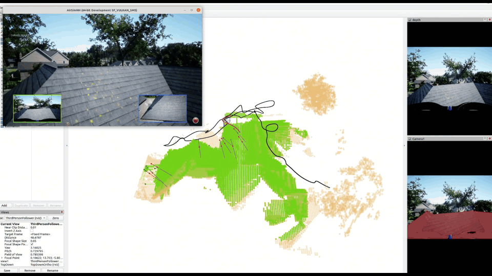

# SEAC: Simultaneous Exploration and Coverage for Surface Inspection of Complex Structures Using a UAV

## Abstract

Surface visual inspection using Unmanned Aerial Vehicles (UAVs) is an efficient way for High‑Definition (HD) structural health monitoring. Classic Explore‑Then‑Exploit (ETE) workflows decouple tasks into sequential stages including online exploration and offline coverage, which are time‑consuming and susceptible to localization drift. This study proposes an online path planner for the **Simultaneous Exploration And Coverage (SEAC)** of complex structures using a UAV.

*Example of SEAC on complex structures.*

---

## Key Features

- ✅ **Simultaneous exploration & coverage** – no separate offline coverage stage.
- ✅ **Real‑time operation** – hierarchical planning ensures fast computation suitable for onboard deployment.
- ✅ **High coverage rate** – achieves >90% surface coverage under strict visual inspection constraints.
- ✅ **Robust to complex geometries** – validated on buildings and bridges.
- ✅ **Modular ROS implementation** – easy to adapt for different UAV platforms.

---

## Target-Aware Inspection

A 3D value map is developed based on instance segmentation and vision-language models, which can be added to the mapping module of SEAC to perform a zero-shot target-aware inspection.
Therefore, the UAV can focus on exploring and inspecting target structures in a complex environment without searching through the whole space.

An implementation of target-aware SEAC in AirSim is shown as follows:

*Example of inspecting the house in complex environment with trees, shrub and vehicles.*

## Installation

> **Note:** The source code will be released soon.
